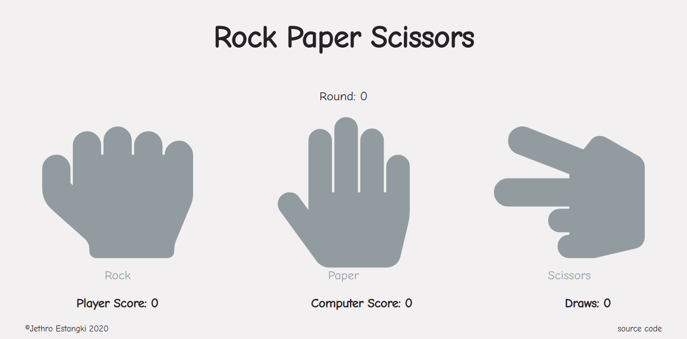

# Rock Paper Scissors
Rock Paper Scissors is a game played usually by two people, but in this case, you play with an AI.
  It is a project required by [The Odin Project's](https://www.theodinproject.com/) [curriculum](https://www.theodinproject.com/courses/web-development-101/lessons/rock-paper-scissors)

## Tools
I used Visual Studio Code for the code. 
Icons from [Font Awesome](https://fontawesome.com/)

## To-do
* Make responsive
* Add multiplayer
